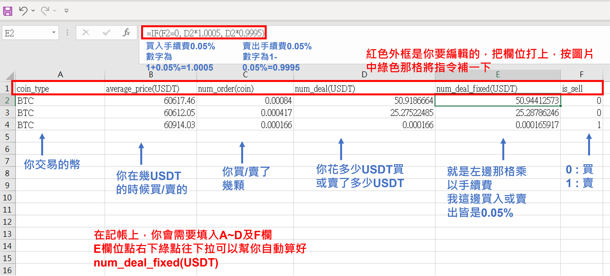
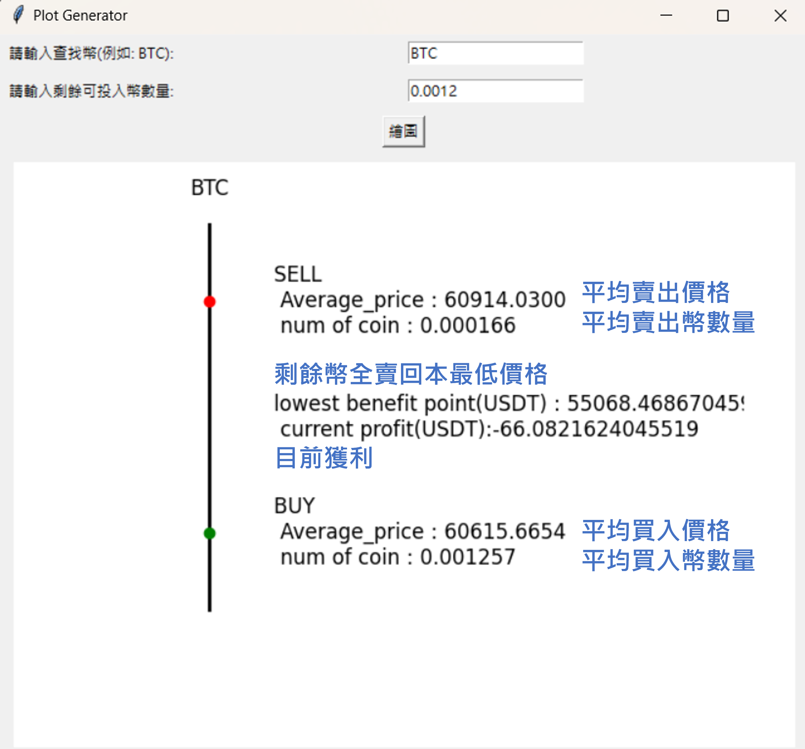

# 動機
隨著交易次數增加，買入在不同價位的幣若沒有記帳很容易不知道下次回本價位是多少，本套件通過excel編輯記帳並轉換成圖片以利查帳紀錄獲利

# 介紹
加載紀錄於excel中的資料，計算平均買入價位及平均賣出價位用以得知獲利程度，以及最低要把剩下全部幣賣在甚麼價位才能回本，並以圖表可視化表現。

# 使用教學

## STEP.1 安裝git

- [點我前往連結](https://git-scm.com/download/win)
- 根據電腦規格選擇下載64bit或32bit

## STEP.2 下載資料
- 在桌面新增一個資料夾
- 右鍵選擇以終端開啟
- 輸入 git clone https://github.com/Kuanying-Wu/bitcoin
- 在bitcoin資料夾中新增一個excel文件(欄位寫法如圖，注意文字大小寫不能有錯)，檔名為record.xlsx(注意不能有錯)
- coin_type
- average_price(USDT)
- num_order(coin)
- num_deal(USDT)
- num_deal_fixed(USDT)
- is_sell
- =IF(F2=0, D2\*1.0005, D2\*0.9995) 記得改數字
- 最後將工作表名稱改成 main (在表格下面)，他只會讀取該工作表的內容，不會讀取其他的工作表

- 之後記帳用excel紀錄，編輯完成記得Ctrl+s儲存

## STEP.3 圖表 
- 點擊 execute.bat

# 注意事項
- excel記帳中對於同一種幣需要個別至少一次的買入和賣出圖片才能正常顯示
- 套件是專為現貨交易紀錄使用，當然不限於幣圈，有買賣投資股票excel中把'coin_type'欄位下BTC換成你投資的名子(記得和產圖寫入的名稱要一樣)，USDT就當台幣看。
- 為避免bug，記帳表格(main)請不要有缺空

# 免責聲明
本套件僅為交易方便做使用，並無任何教唆投資目的，若有虧錢不關我的事謝謝。

